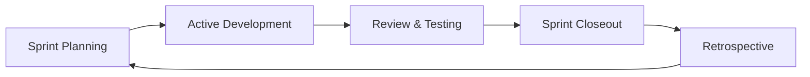
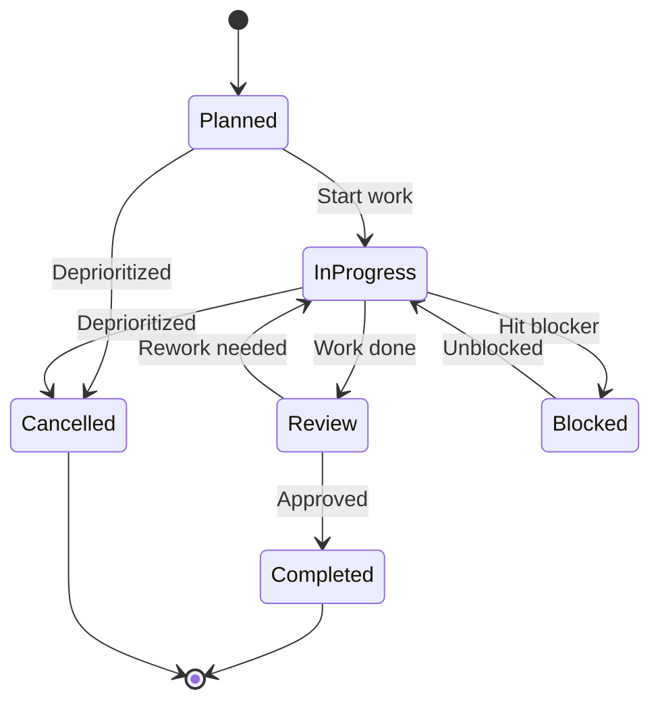
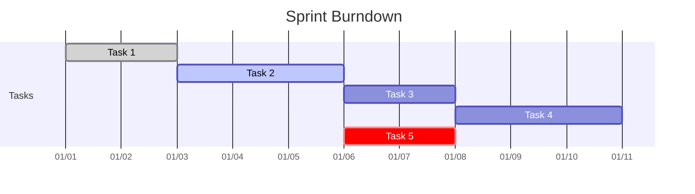
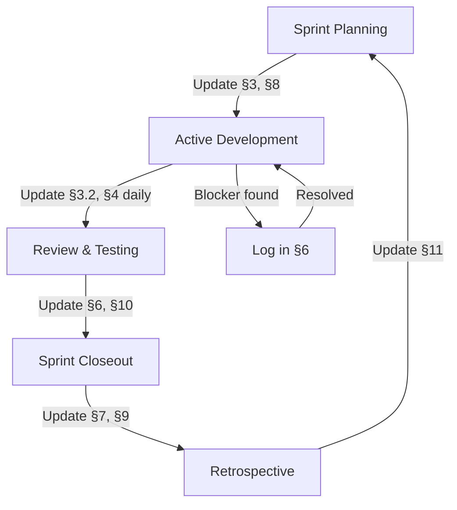

# Progress Tracker: [Project Name]

| Field                | Value                         |
| -------------------- | ----------------------------- |
| **Document Version** | 1.0                           |
| **Date**             | [YYYY-MM-DD]                  |
| **Author(s)**        | [Name(s)]                     |
| **Status**           | [Draft / Proposed / Approved] |
| **Active Branch**    | [branch name]                 |

### Version History

| Version | Date   | Summary                  |
| ------- | ------ | ------------------------ |
| 1.0     | [Date] | Initial progress tracker |

### Severity Legend

| Label              | Meaning                                                       |
| ------------------ | ------------------------------------------------------------- |
| 🔴 **MANDATORY**   | Must be kept up to date — stale data blocks accurate planning |
| 🟡 **RECOMMENDED** | Should be updated regularly for project visibility            |
| 🟢 **OPTIONAL**    | Useful context — update when practical                        |

---

## Table of Contents

- [1 — Introduction](#1--introduction)
  - [1.1 — Purpose](#11--purpose)
  - [1.2 — Scope](#12--scope)
  - [1.3 — Definitions, Acronyms, and Abbreviations](#13--definitions-acronyms-and-abbreviations)
  - [1.4 — References](#14--references)
  - [1.5 — Overview](#15--overview)
- [2 — Status Definitions](#2--status-definitions)
- [3 — Active Tasks / Sprints](#3--active-tasks--sprints)
  - [3.1 — Current Sprint](#31--current-sprint)
  - [3.2 — Sprint Backlog](#32--sprint-backlog)
- [4 — Recent Updates](#4--recent-updates)
- [5 — Milestone Tracking](#5--milestone-tracking)
- [6 — Blockers and Issues](#6--blockers-and-issues)
- [7 — Completed Work](#7--completed-work)
- [8 — Upcoming Work](#8--upcoming-work)
- [9 — Team Velocity](#9--team-velocity)
- [10 — Quality Metrics](#10--quality-metrics)
- [11 — Notes and Decisions](#11--notes-and-decisions)
- [12 — Update Rules](#12--update-rules)
- [Appendix A — Burndown Chart](#appendix-a--burndown-chart)
- [Appendix B — Links to External Tools](#appendix-b--links-to-external-tools)
- [Appendix C — Sprint Lifecycle](#appendix-c--sprint-lifecycle)
- [Appendix D — Entry Templates](#appendix-d--entry-templates)

---

## 1 — Introduction

### 1.1 — Purpose

> _This document serves as the central hub for tracking day-to-day progress, active tasks, blockers, and milestones throughout the project lifecycle._

[Briefly describe how this document will be used and who should update it.]

### 1.2 — Scope

> _Define what aspects of the project this tracker covers (e.g., development tasks only, includes design and QA, etc.)._

| Boundary         | Description |
| ---------------- | ----------- |
| **In scope**     |             |
| **Out of scope** |             |

### 1.3 — Definitions, Acronyms, and Abbreviations

| Term   | Definition   |
| ------ | ------------ |
| [Term] | [Definition] |

### 1.4 — References

> _List any related documents, such as the project brief, technical specification, or external tracking tools._

| Document      | Location        |
| ------------- | --------------- |
| `agents.md`   | Repository root |
| [Reference 1] | [Link/Path]     |
| [Reference 2] | [Link/Path]     |

### 1.5 — Overview

> _Briefly describe how this document is organized and how to use it effectively._

This document follows the sprint lifecycle:



Each section maps to a phase:

| Phase                  | Sections                                                                                |
| ---------------------- | --------------------------------------------------------------------------------------- |
| **Sprint Planning**    | [§3 — Active Tasks](#3--active-tasks--sprints), [§8 — Upcoming Work](#8--upcoming-work) |
| **Active Development** | [§3.2 — Sprint Backlog](#32--sprint-backlog), [§4 — Recent Updates](#4--recent-updates) |
| **Review & Testing**   | [§6 — Blockers](#6--blockers-and-issues), [§10 — Quality Metrics](#10--quality-metrics) |
| **Sprint Closeout**    | [§7 — Completed Work](#7--completed-work), [§9 — Velocity](#9--team-velocity)           |
| **Retrospective**      | [§11 — Notes and Decisions](#11--notes-and-decisions)                                   |

---

## 2 — Status Definitions

> _Standardized status indicators used throughout this tracker._

| Status          | Icon | Definition                                            | Transitions To                  |
| --------------- | ---- | ----------------------------------------------------- | ------------------------------- |
| **Planned**     | ⚪   | Task is defined but not yet started                   | In Progress, Cancelled          |
| **In Progress** | 🟡   | Actively being worked on                              | Review, Blocked, Cancelled      |
| **Blocked**     | 🔴   | Cannot proceed due to an external dependency or issue | In Progress (once unblocked)    |
| **Review**      | 🔵   | Work completed, awaiting review or testing            | Completed, In Progress (rework) |
| **Completed**   | 🟢   | Reviewed, tested, and merged/delivered                | — (terminal)                    |
| **Cancelled**   | ⚫   | No longer required or deprioritized                   | — (terminal)                    |



---

## 3 — Active Tasks / Sprints

### 3.1 — Current Sprint

> _Details of the active sprint or work period._

| Field           | Value                                   |
| --------------- | --------------------------------------- |
| **Sprint Name** | [Sprint 1: Foundation]                  |
| **Dates**       | [YYYY-MM-DD] to [YYYY-MM-DD]            |
| **Goal**        | [Brief description of sprint objective] |
| **Lead**        | [Name]                                  |
| **Branch**      | [Active branch name]                    |

### 3.2 — Sprint Backlog

🔴 _All tasks in the current sprint, organized by status. Update this daily._

| Task / Feature                     | Owner  | Status         | Priority | Notes                      | Est. Hours | Act. Hours |
| ---------------------------------- | ------ | -------------- | -------- | -------------------------- | ---------- | ---------- |
| [Task 1: Set up repository]        | [Name] | 🟢 Completed   | P0       | Initialized with README    | 2          | 2          |
| [Task 2: Configure CI/CD]          | [Name] | 🟡 In Progress | P0       | Waiting for access keys    | 4          | 2          |
| [Task 3: Database schema design]   | [Name] | 🔵 Review      | P1       | PR submitted               | 3          | 3          |
| [Task 4: User authentication]      | [Name] | ⚪ Planned     | P1       | Will start after CI/CD     | 5          | 0          |
| [Task 5: API endpoint: GET /users] | [Name] | 🔴 Blocked     | P2       | Blocked by database schema | 3          | 0          |

**Priority Levels:**

| Priority | Meaning                                       |
| -------- | --------------------------------------------- |
| **P0**   | Critical — must complete this sprint          |
| **P1**   | Important — should complete this sprint       |
| **P2**   | Normal — complete if capacity allows          |
| **P3**   | Low — can defer to next sprint without impact |

---

## 4 — Recent Updates

🔴 _Maintain a reverse-chronological log of major updates, decisions, or merges. Update this daily or as significant events occur._

| Date         | Category    | Update                                                                      | Author | Impact |
| ------------ | ----------- | --------------------------------------------------------------------------- | ------ | ------ |
| [YYYY-MM-DD] | 🟢 Merge    | [e.g., "Merged feature branch for user authentication. All tests passing."] | [Name] | Low    |
| [YYYY-MM-DD] | 🔴 Blocker  | [e.g., "CI/CD pipeline failing due to missing secrets. DevOps notified."]   | [Name] | High   |
| [YYYY-MM-DD] | 📋 Planning | [e.g., "Sprint planning completed. Sprint 1 kicked off."]                   | [Name] | —      |

**Update Categories:**

| Category     | When to use                                       |
| ------------ | ------------------------------------------------- |
| 🟢 Merge     | Feature branch merged, PR closed                  |
| 🔴 Blocker   | New blocker identified or resolved                |
| 📋 Planning  | Sprint planning, scope changes, re-prioritization |
| ⚙️ Technical | Architecture decisions, dependency changes        |
| 🐛 Bug       | Bug discovered, fixed, or escalated               |
| 📖 Docs      | Documentation created or updated                  |

---

## 5 — Milestone Tracking

🔴 _Overview of major project milestones and their current status._

| Milestone       | Target Date | Current Status | % Complete | Risk Level | Notes                       |
| --------------- | ----------- | -------------- | ---------- | ---------- | --------------------------- |
| **MVP Release** | [Date]      | ⚪ Planned     | 0%         | 🟢 Low     |                             |
| **v1.0 Launch** | [Date]      | ⚪ Planned     | 0%         | 🟢 Low     |                             |
| [Milestone 3]   | [Date]      | 🟡 In Progress | 45%        | 🟡 Medium  | On track                    |
| [Milestone 4]   | [Date]      | 🔴 Blocked     | 20%        | 🔴 High    | Waiting for third-party API |

**Risk Levels:**

| Level         | Meaning                                                 |
| ------------- | ------------------------------------------------------- |
| 🟢 **Low**    | On track, no known issues                               |
| 🟡 **Medium** | Minor delays possible, mitigation plan in place         |
| 🔴 **High**   | Significant risk of missing target, escalation required |

---

<details>
<summary><strong>Milestone Details</strong></summary>

#### Milestone: MVP Release

- **Description**: [Brief description of what constitutes MVP]
- **Requirements**:
  - [ ] User registration/login
  - [ ] Core feature A implementation
  - [ ] Basic dashboard
  - [ ] Database setup
- **Dependencies**: [List any dependencies]
- **Risks**: [List any risks specific to this milestone]

#### Milestone: v1.0 Launch

- **Description**: [Brief description of v1.0 scope]
- **Requirements**:
  - [ ] Feature B implementation
  - [ ] Feature C implementation
  - [ ] Performance optimization
  - [ ] Documentation complete
  - [ ] User acceptance testing
- **Dependencies**: [List any dependencies]
- **Risks**: [List any risks specific to this milestone]

</details>

---

## 6 — Blockers and Issues

🔴 _Track all current blockers and significant issues that require attention. See also: `agents.md` §16.3 for the error escalation flow._

| ID      | Description                                                   | Date Identified | Owner  | Impact                     | Resolution Plan                                             | Status         |
| ------- | ------------------------------------------------------------- | --------------- | ------ | -------------------------- | ----------------------------------------------------------- | -------------- |
| BLK-001 | [e.g., "Cannot access production database credentials"]       | [Date]          | [Name] | Blocks deployment          | Contact DevOps for access; create temp dev DB as workaround | 🟡 In Progress |
| BLK-002 | [e.g., "Third-party API rate limiting causing test failures"] | [Date]          | [Name] | Delays integration testing | Implement mock service for tests; request higher limits     | 🟢 Resolved    |
| BLK-003 | [e.g., "Design assets not delivered"]                         | [Date]          | [Name] | Blocks UI development      | Use placeholder assets; follow up with design team          | 🔴 Active      |

**Blocker Severity:**

| Severity    | Impact                            | Response Time   |
| ----------- | --------------------------------- | --------------- |
| 🔴 Critical | Blocks entire sprint or milestone | Same day        |
| 🟡 Major    | Blocks one or more tasks          | Within 24 hours |
| 🟢 Minor    | Delays task but workaround exists | Within sprint   |

---

## 7 — Completed Work

🟡 _Archive of completed tasks and deliverables from previous sprints._

### Sprint [Number/Name] ([Dates])

| Task     | Owner  | Completed Date | Notes |
| -------- | ------ | -------------- | ----- |
| [Task 1] | [Name] | [Date]         |       |
| [Task 2] | [Name] | [Date]         |       |
| [Task 3] | [Name] | [Date]         |       |

### Sprint [Number/Name] ([Dates])

| Task     | Owner  | Completed Date | Notes |
| -------- | ------ | -------------- | ----- |
| [Task 1] | [Name] | [Date]         |       |
| [Task 2] | [Name] | [Date]         |       |
| [Task 3] | [Name] | [Date]         |       |

---

## 8 — Upcoming Work

🟡 _Tasks planned for future sprints or next steps._

### Next Sprint ([Dates])

| Task     | Owner  | Priority | Est. Hours | Dependencies       |
| -------- | ------ | -------- | ---------- | ------------------ |
| [Task 1] | [Name] | P0       | [Hours]    | [Any dependencies] |
| [Task 2] | [Name] | P1       | [Hours]    | [Any dependencies] |
| [Task 3] | [Name] | P2       | [Hours]    | [Any dependencies] |

### Future Considerations (Backlog)

| Item                         | Type         | Priority | Notes |
| ---------------------------- | ------------ | -------- | ----- |
| [Feature idea 1]             | Feature      | P2       |       |
| [Feature idea 2]             | Feature      | P3       |       |
| [Technical debt item 1]      | Tech Debt    | P1       |       |
| [Optimization opportunity 1] | Optimization | P3       |       |

---

## 9 — Team Velocity

🟡 _Track the team's capacity and velocity over time for better planning._

| Sprint      | Planned Hours | Completed Hours | Velocity | Carryover | Notes                       |
| ----------- | ------------- | --------------- | -------- | --------- | --------------------------- |
| Sprint 1    | 40            | 38              | 0.95     | 2h        | Slight under due to blocker |
| Sprint 2    | 45            | 42              | 0.93     | 3h        |                             |
| Sprint 3    | 42            | 44              | 1.05     | 0h        | Overtime due to deadline    |
| **Average** |               |                 | **0.98** |           |                             |

🟢 _Use the average velocity to calibrate future sprint planning. If velocity drops below 0.85 for two consecutive sprints, trigger a retrospective._

---

## 10 — Quality Metrics

🟡 _Track code quality, test coverage, and other quality indicators._

| Metric             | Target | Current | Trend        | Status | Notes                      |
| ------------------ | ------ | ------- | ------------ | ------ | -------------------------- |
| Test Coverage      | 80%    | 72%     | 📈 Improving | 🟡     | Added unit tests this week |
| Critical Bugs      | 0      | 2       | 📉 Worsening | 🔴     | Two new bugs reported      |
| Build Success Rate | 95%    | 92%     | 📈 Improving | 🟡     |                            |
| Code Review Time   | <24h   | 18h     | 📊 Stable    | 🟢     |                            |

**Trend Indicators:**

| Trend        | Meaning                                       |
| ------------ | --------------------------------------------- |
| 📈 Improving | Metric moving toward target                   |
| 📉 Worsening | Metric moving away from target — needs action |
| 📊 Stable    | Metric holding steady                         |

### Open Bugs

| ID      | Description   | Severity | Status         | Assigned To | Identified | Target Fix |
| ------- | ------------- | -------- | -------------- | ----------- | ---------- | ---------- |
| BUG-001 | [Description] | High     | 🟡 In Progress | [Name]      | [Date]     | [Date]     |
| BUG-002 | [Description] | Medium   | ⚪ Planned     | [Name]      | [Date]     | [Date]     |
| BUG-003 | [Description] | Low      | 🟢 Completed   | [Name]      | [Date]     | [Date]     |

---

## 11 — Notes and Decisions

🟢 _Capture important decisions, context, or notes that don't fit elsewhere._

<details>
<summary><strong>Decision Template</strong></summary>

### [YYYY-MM-DD] - Decision: [Title]

| Field         | Details                          |
| ------------- | -------------------------------- |
| **Context**   | [What led to this decision]      |
| **Decision**  | [What was decided]               |
| **Rationale** | [Why this decision was made]     |
| **Impact**    | [How this affects the project]   |
| **Status**    | [Proposed / Accepted / Reversed] |

</details>

<details>
<summary><strong>Meeting Summary Template</strong></summary>

### [YYYY-MM-DD] - Meeting: [Title]

| Field         | Details |
| ------------- | ------- |
| **Attendees** | [Names] |
| **Duration**  | [Time]  |

**Key Points:**

- [Point 1]
- [Point 2]

**Action Items:**

| Action   | Owner  | Due Date | Status |
| -------- | ------ | -------- | ------ |
| [Action] | [Name] | [Date]   | ⚪     |
| [Action] | [Name] | [Date]   | ⚪     |

</details>

---

## 12 — Update Rules

🔴 This section defines **when** and **how** this document must be updated.

### Update Frequency

| Section               | Update Trigger                              | Severity |
| --------------------- | ------------------------------------------- | -------- |
| §3 Sprint Backlog     | Any task status change                      | 🔴       |
| §4 Recent Updates     | Daily, or on any significant event          | 🔴       |
| §5 Milestones         | Any milestone progress or risk change       | 🔴       |
| §6 Blockers           | Immediately on identification or resolution | 🔴       |
| §7 Completed Work     | End of each sprint                          | 🟡       |
| §8 Upcoming Work      | During sprint planning                      | 🟡       |
| §9 Velocity           | End of each sprint                          | 🟡       |
| §10 Quality Metrics   | Weekly or on significant change             | 🟡       |
| §11 Notes & Decisions | When a decision is made or meeting occurs   | 🟢       |

### Update Checklist

🔴 Before closing out any work session, walk through:

```markdown
- [ ] Sprint backlog statuses are current (§3.2)
- [ ] Any blockers added or resolved are logged (§6)
- [ ] Recent updates log has today's entry (§4)
- [ ] Milestone percentages are accurate (§5)
- [ ] Branch metadata matches current active branch (§3.1)
```

### Ownership

| Role                 | Responsibility                                                      |
| -------------------- | ------------------------------------------------------------------- |
| **Sprint Lead**      | Owns §3, §8, §9 — ensures backlog and velocity are accurate         |
| **All team members** | Own their task statuses in §3.2 and §4 updates                      |
| **Agent (AI)**       | Must update §3.2 and §4 after every task; reference `agents.md` §10 |

---

## Appendix A — Burndown Chart

🟢 _Visual representation of sprint progress (if applicable)._



> Replace with actual sprint dates and task durations.

---

## Appendix B — Links to External Tools

| Tool                | Link                                  | Purpose             |
| ------------------- | ------------------------------------- | ------------------- |
| **Project Board**   | [Link to Jira/Trello/GitHub Projects] | Task tracking       |
| **CI/CD Dashboard** | [Link to CI tool]                     | Build/deploy status |
| **Monitoring**      | [Link to monitoring dashboard]        | Runtime health      |
| **Repository**      | [Link to repo]                        | Source code         |

---

## Appendix C — Sprint Lifecycle

The full sprint lifecycle with update responsibilities:



---

## Appendix D — Entry Templates

### New Task Entry

```markdown
| [Task Name] | [Owner] | ⚪ Planned | P[0-3] | [Notes] | [Est. Hours] | 0 |
```

### New Blocker Entry

```markdown
| BLK-[NNN] | [Description] | [Date] | [Owner] | [Impact] | [Resolution Plan] | 🔴 Active |
```

### New Update Entry

```markdown
| [YYYY-MM-DD] | [Category] | [Description] | [Author] | [Impact] |
```

### New Bug Entry

```markdown
| BUG-[NNN] | [Description] | [Severity] | ⚪ Planned | [Assigned To] | [Date] | [Target Date] |
```

### New Decision Entry

```markdown
### [YYYY-MM-DD] - Decision: [Title]

| Field         | Details                          |
| ------------- | -------------------------------- |
| **Context**   | [What led to this decision]      |
| **Decision**  | [What was decided]               |
| **Rationale** | [Why this decision was made]     |
| **Impact**    | [How this affects the project]   |
| **Status**    | [Proposed / Accepted / Reversed] |
```

---

_This template is provided under the [MIT License](https://opensource.org/licenses/MIT)._
